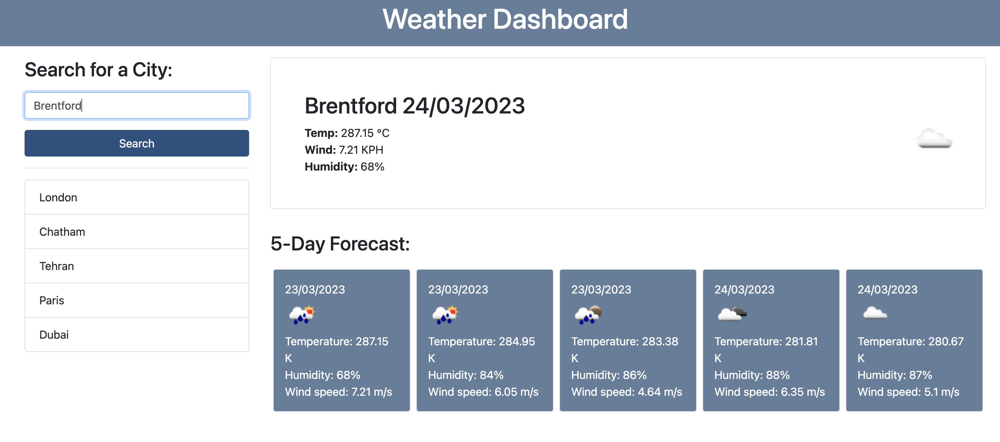

# Weather Forecast

## Description
The Weather Forecast project is a simple application that allows users to retrieve current weather data and forecasts for a specific location. This project uses the OpenWeatherMap API to fetch weather data and provides the following information for current day and next 5 days:

* Current temperature
* Wind speed
* Humidity

## Installation
To install the Weather Forecast project, Clone the repository to your local machine:

`git clone https://github.com/KianaMsqt/weather-forecast.git`

## Demo

In the following you can see a screenshot of the application:

Also, You can reach the deployed application on th efollowing link:
https://kianamsqt.github.io/weather-forecast/

## License
The Weather Forecast project is licensed under the MIT license. See the LICENSE file for more details.